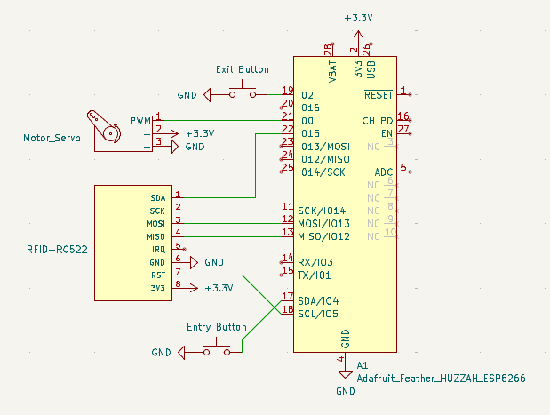

# Gate Control

This project implements an automated gate control system using ESP8266, RFID, a State Machine, and MQTT for communication with the Web Manager.

## Project Structure

-   `gateControl.ino`: Main file, integrates all modules and implements the core logic.
-   `GateControl.h/.cpp`: Manages the state machine and orchestrates the modules.
-   `WiFiService.h/.cpp`: Handles WiFi connection.
-   `MQTTService.h/.cpp`: Manages MQTT communication (broker, topics, messages).
-   `RFIDService.h/.cpp`: Handles reading and writing RFID cards.
-   `ButtonService.h/.cpp`: Manages physical buttons for reading and writing (software debounce).
-   `ServoService.h/.cpp`: Controls the servo motor responsible for opening/closing the gate.

## How It Works

1. **Initialization:** All modules are configured and started.
2. **Card Writing:** When the Entry button is pressed, the system requests a parking spot via MQTT from the Web Manager, waits for a response, and writes the spot info to the RFID card.
3. **Card Reading:** When the Exit button is pressed, the system reads the RFID card and sends the data via MQTT to register the exit.
4. **Gate Operation:** The servo motor is activated to open/close the gate according to entry/exit flow.

## Requirements

-   Arduino IDE
-   ESP8266
-   MFRC522 RFID Reader
-   Servo motor
-   Physical buttons (with software debounce)
-   MQTT Broker (e.g., HiveMQ)
-   Libraries: `ESP8266WiFi`, `PubSubClient`, `MFRC522`, `Servo`, `ArduinoJson`

## Circuit

> Fig. 1: Electronic schematic of the gate device.

## Usage

1. Upload the files to the ESP8266 using the Arduino IDE.
2. Adjust WiFi credentials and MQTT topics as needed in the configuration files.
3. Connect the hardware components according to the pin definitions in the `.h` files.
4. Run the system and monitor via Serial output or MQTT messages.

---

## To Do

-   Fix infinite loops (add timeout for waiting operations).
-   Add confirmation via MQTT for exit events to ensure the gate only opens after a successful exit registration.

---

<h6 align="center">by David Propato <a href="https://github.com/Propato">@Propato</a> & Klarine Mendonça <a href="https://github.com/Klarinemend">@Klarinemend</a></h6>
